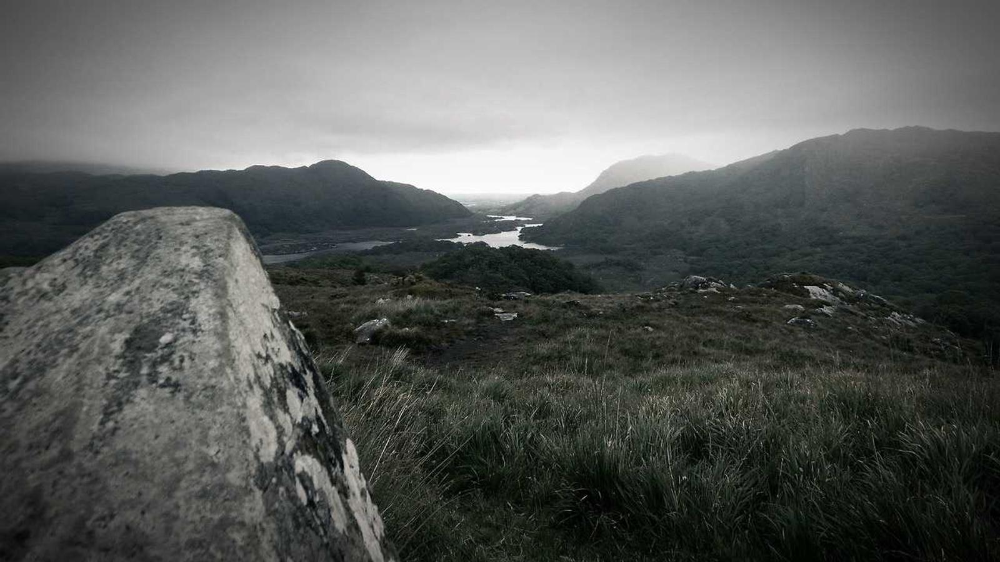

# 图片管线自检

这篇文章是图片支持的长期回归 fixture: 覆盖独占图、行内图与外链图三种形态。

## 独占图

独占段落的图片在终端里是占位框, 在镜像页里是真图:

一张真实照片(原图 1600×900, 构建期自动缩到 1080 宽):

## 行内图

段落中夹一张  小图, 终端里降级为 `[图: …]` 链接。

## 外链图

外部图片原样透传, 不校验、不复制、不计预算:

