# Weekly Report 2026-03-16

## 工作任务

1.Linux内核中RV相关部分有哪些，存量代码有多少（行）

2.RV增量代码每周大概有多少行（关键问题），每周更新频率，维护人多少

3.已有RV相关Linux内核CVE特性分析，尤其是RV特有的漏洞

4.用什么工具去挖漏洞（不限制手段，以挖到为目标，后期考虑增量代码与方法架构）

5.现有工具调研

## 工作进展

### Linux内核riscv存量代码分析

本周进展

使用python脚本将riscv代码存量代码基本全部找出，并且按照子系统进行分类，并且使用一个简单的前端进行成果展示

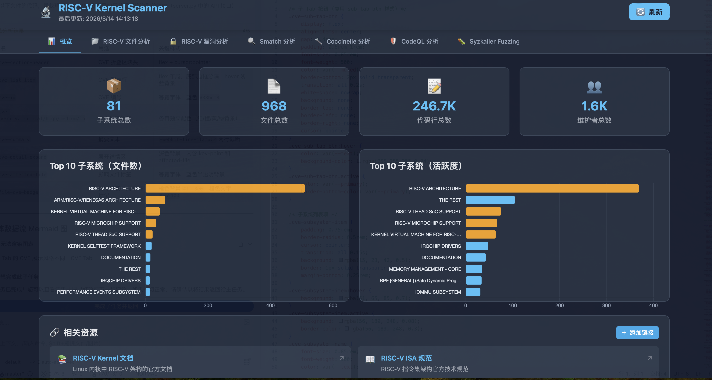

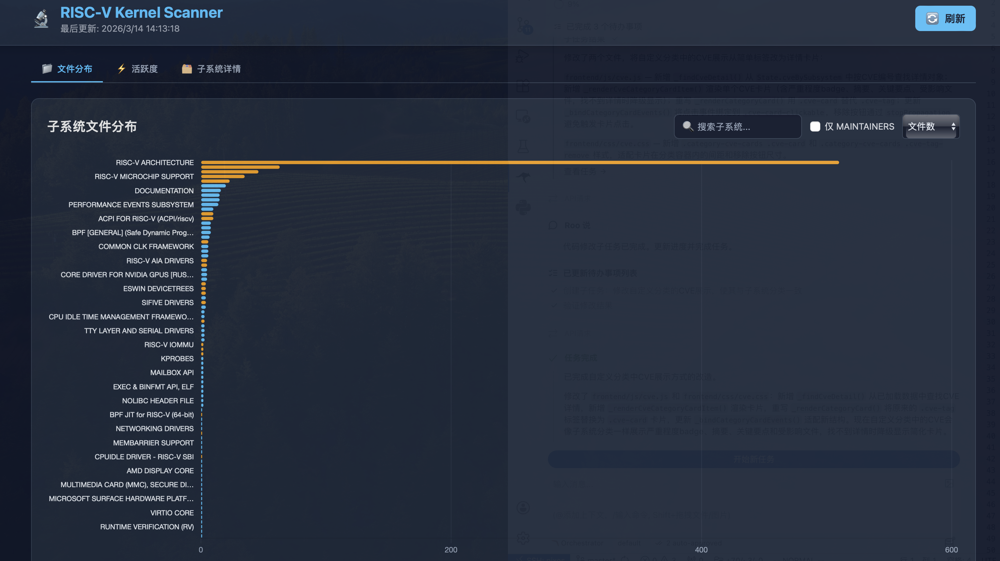

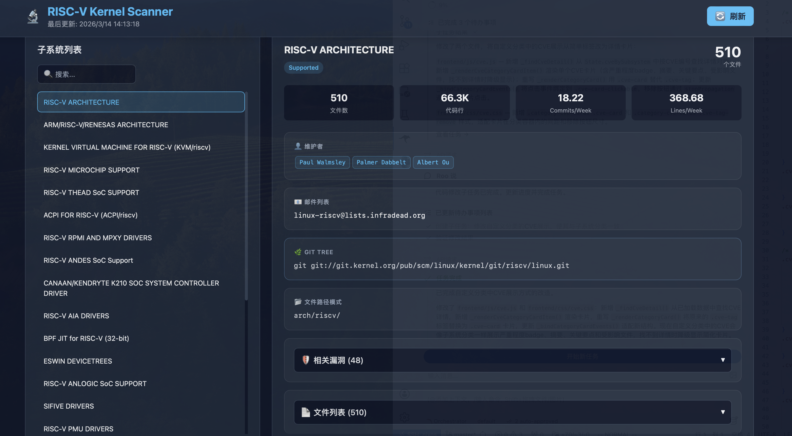

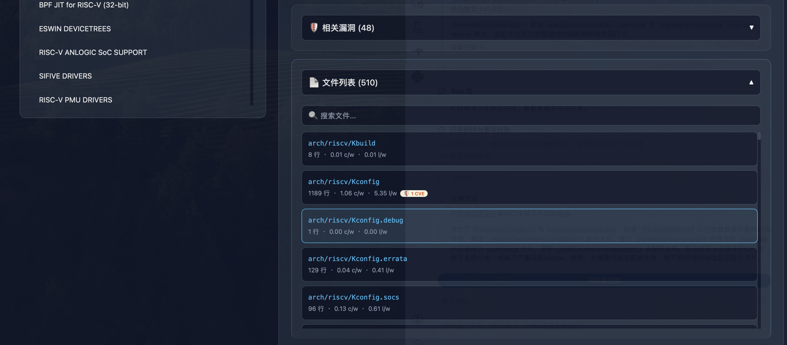

遇到的问题及解决方法

问题就是不知道怎么找riscv相关的代码，解决方法是三种方案找riscv的代码

- Maintainer标注的dir下所有的files

- 使用find通过关键词寻找文件名匹配的files

- 使用grep通过关键词和过滤寻找文件内容匹配的files

### Linux内核riscv代码增量分析

本周进展

通过分析riscv代码上一部找出的所有文件的分文件git log，找他近2年（可配置）的commit log，对其代码行数和commit进行取一周平均值，并收集所有对这个文件commit的contributer

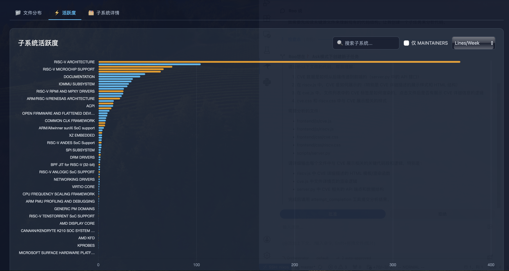

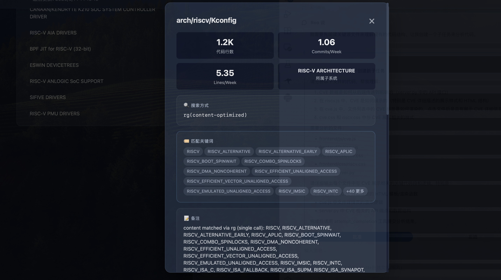

### Linux内核riscv CVE漏洞分类以及特性分析

本周进展

这个任务仅仅只是做了基本的按照子系统分类，但是前端有机制让我能进行自定义分类，这需要手工进行一个一个分析并分类（暂时没做）

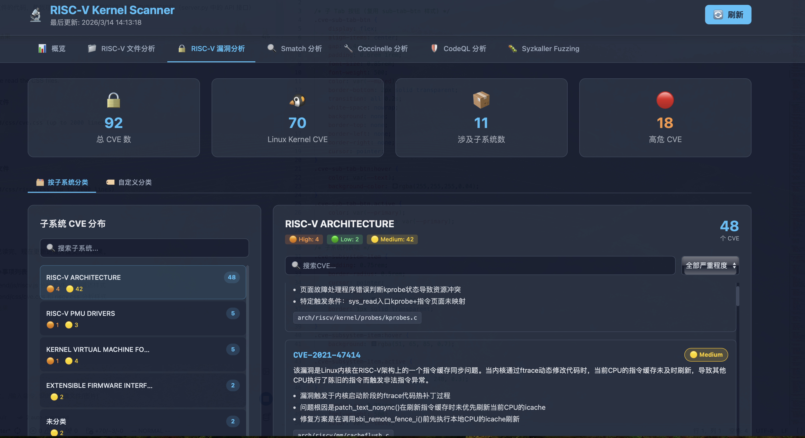

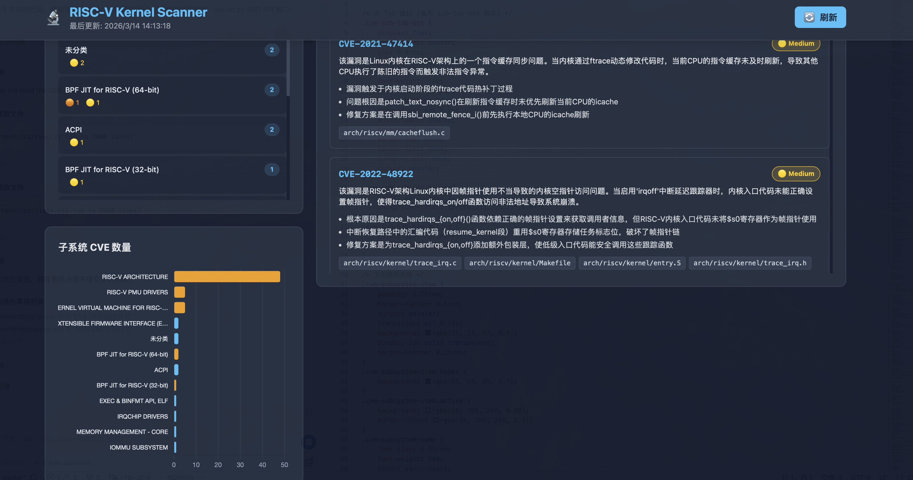

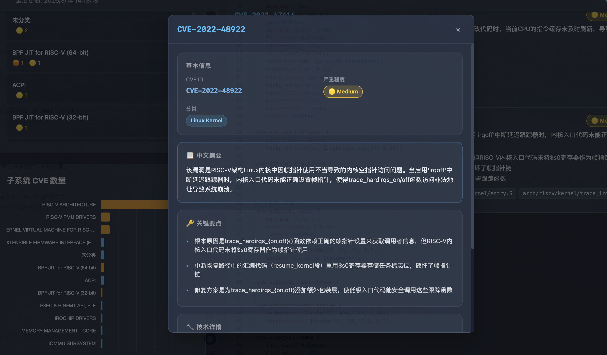

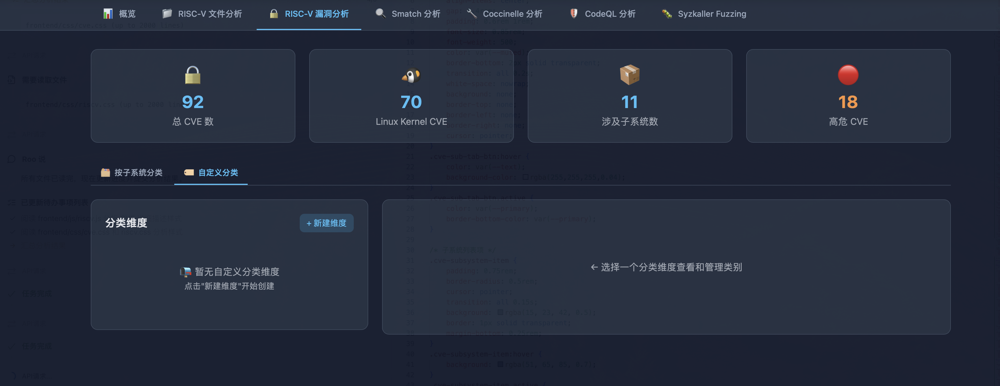

### 漏洞挖掘工具调研

本周进展

对于主流的静态和动态工具进行调研，并集成到了前端展示（后端是使用python调用makefile来实现），支持

- Smatch静态分析

- Coccinelle静态分析

- codeQL静态分析

- syzkaller fuzz动态分析

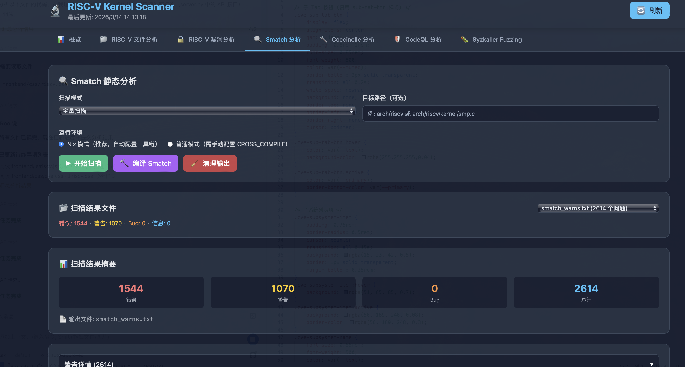

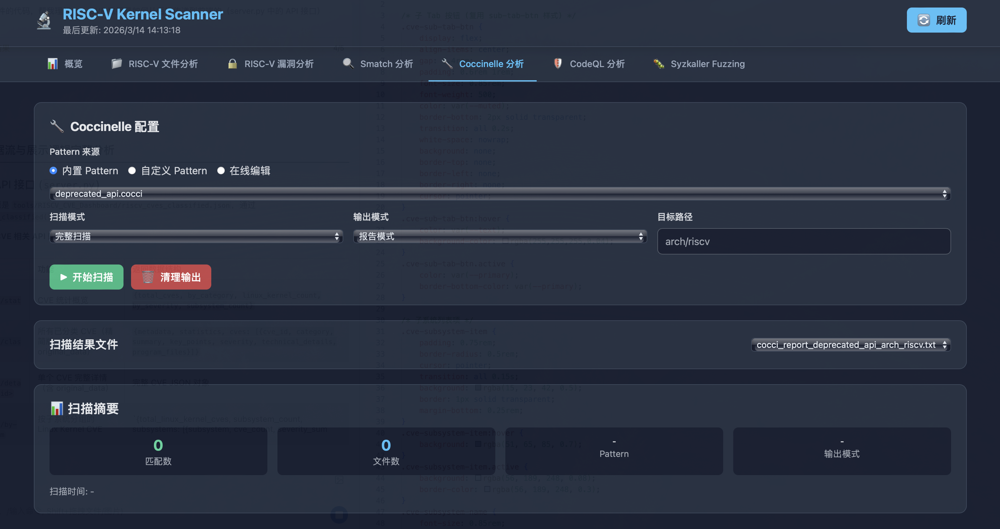

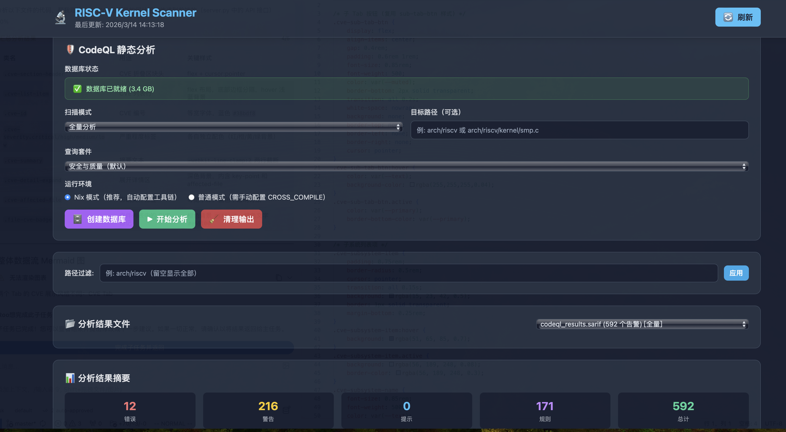

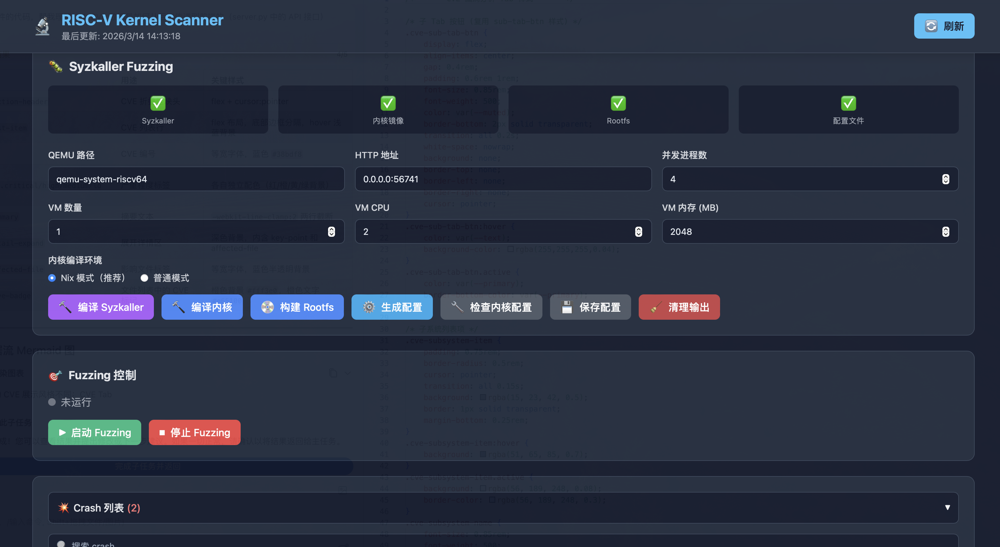

未解决的问题

仅仅只是做了集成，我还没有懂太具体的用法，比如说静态分析工具pattern如何写？syzkaller是否有其他好用的feature等等

## 下周计划

Riscv漏洞特性分析

其余工作内容需要讨论
