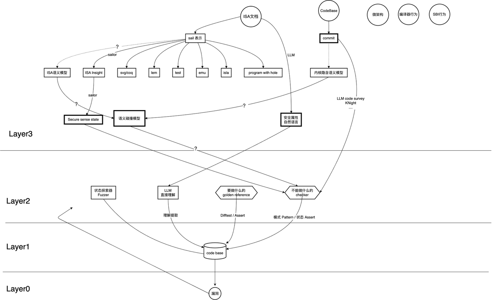

# Weekly Report 2026-04-05

## 工作任务 （周四开会后）

1.统计各个工具扫到的漏洞中缺乏RV语义能力，统计占比

2.找语义强相关的RV漏洞例子，论证“传统工具缺乏语义背景知识，难以检测出RV漏洞”

3.拿语义强相关的漏洞跑一下Knighter

## 工作进展

**======周一-周四（开会前）=====**

### 调研从riscv isa文档到具体代码实现的中间层pattern的形式

由于上周只是做了调研以及一些头脑风暴，这周主要将上周的调研结果和头脑风暴结果做了一些整合，把他们统一起来，放到了一个漏洞挖掘的思维模型里面

（源drawio格式模型图见附件）

此模型分为四层，layer0是最终的目标（dest），即漏洞，layer3是所有的起点（src），他是各种规范以及各种行为（用圆圈表示），然后希望能使用这个模型  
1.囊括几乎所有漏洞挖掘方法。2.不说给解决问题提供框架，只能说至少让我能知道还存在什么问题。  
下面是各层的描述

- Layer0: **漏洞/bugs**，即最终的目标

- Layer1: **CodeBase**，即需要研究/挖掘的对象，简单来说就是arch/riscv目录（这是第一周做的事情）

- Layer2: **能直接产出漏洞的工具**，即使用他们分析codebase能直接产生漏洞，他们包括“状态探索器Fuzzer”，“LLM直接代码分析”，“需要做什么的golden reference”，“禁止做什么的Checker”，本质就是需要将所有其他形式转换/加强成layer2的形式，才能产生真正的漏洞（工具调研是第一周/第二周做的事情）

- Layer3: **各种语义模型**，即最开始的起点，包括ISA规范，codebase本身的行为，微架构特定的行为，编译器行为，SBI执行环境行为  
  但是他们和layer2的工具有很大的语义差异，需要一步一步将这些源语义转换成其他语义模型（需要证明转换等价或者保留部分原意），或者与其他语义模型横向碰撞/融合/交叉验证，直到某个语义模型能打破layer3和layer2的边界  
  举个上周论文Automatic ISA analysis for Secure Context Switching的例子，他做了如下转换：layer3（isa规范🡪sail表示🡪isa insight🡪**security sense state**）然后将这最后一个语义模型就可以很显然的转换成1.fuzzer来找这些state 2.checker来找这些state  
  （上周的其他想法均在上述模型中有体现，但是具体的转换方法需要explore，比如上述的isa insight🡪secure sense state的转换论文使用了他们新研究的算法，所以很多转换路径上都写的是问号代指未知）,隐约感觉到学术界的难点可能就在layer3，工业界的难点就在layer2

**======周四-周日（开会后）=====**

### 统计各个工具扫到的rv漏洞的占比与rv代码行数的占比

首先，依照最基本的直觉，设计了一个实验：

1.  统计riscv的代码文件到filelist并计算出总代码行数

2.  统计编译的所有文件（ARCH=riscv defconfig）到filelist并计算出代码行数

3.  用smatch分别扫描上述的实验对象

4.  统计扫出的漏洞占比以及代码行数的占比

下面是实验结果：

| Kernel版本       | 文件占比               | 扫出的漏洞占比 |
|:-----------------|------------------------|----------------|
| 7.0(rc5)(即最新) | 167042 / 3164886=5.28% | 7 / 2612=0.28% |
| 6.5(rvv支持)     | 96187 / 2337214=4.12%  | 4 / 474=0.84%  |
| 5.16(rv kvm支持) | 41559 / 1774309=2.34%  | 3 / 231=1.30%  |
| 5.7(rv32支持)    | 28188 / ?              | ?              |

表 1 实验结果

（扫出来的漏洞均未经过筛选，5.7内核太老，需要更老的编译器，但是我的nix已经不提供老编译器了，\`llvmPackages_14 has been removed, as it is unmaintained and obsolete\`）

但是riscv被查出有14条告警（包含5个warning），经过人工审核全部是误报

至少能得出一个阶段性的结论：**传统静态工具对于riscv代码的扫描几乎没有效果（但是没有办法通过传统静态工具证明，“对riscv尤其没有效果”这个结论）**

上述实验数据发现，1.rc版本扫出的洞越多，2.越新版本扫出的也越多，后者的原因我猜测是因为1.代码量增多 2.内核机制变更复杂 3.大版本发布时smatch的告警一般会被全部解决，但是实验数据来看，扫出的riscv漏洞的比例确实比文件占比小很多

但是在仔细想想之后，此实验设计存在几个问题难点以及现实问题（在选用smatch内核静态扫描工具的情况下）

1.  Smatch本身的误报率比较高，如果切到旧内核，误报率也仍然会很高，并且riscv是近几年才发展起来的，旧内核riscv代码量可能很少，导致实验样本可能不足

2.  Bug分布的天然差异：arch/ 目录下的漏洞天生比 driver/ 目录下的漏洞少，漏洞在内核不同的子系统之间本来就存在不均匀性，导致扫出来的rv漏洞必然会偏少

3.  静态分析工具本身的局限性，riscv代码中大量漏洞以及代码存在于.S文件中以及各种宏（内联汇编）中，smatch以及其他静态工具本身缺乏这部分的扫描，也会导致漏洞偏少

既然有上述的问题，可能就需要设计新的实验方案，有几种想法

1.  arch/ 目录下进行对比，比如arch/x86 vs arch/riscv，这样可以消除内核本身天然的漏洞分布不均匀性

2.  召回测试：即从已经找到的cve中进行重新召回，比如先从强riscv语义的cve找几个，再从通用语义的cve找几个，用工具重扫，对比这两个的召回率，前者是否比后者低

但是考虑到smatch误报率实在太高，其他静态分析工具估计也好不到哪去，于是就只有换另外的工具，1.有llm加持的静态patch分析工具Knight 2.动态分析工具syzkaller，所以新的实验方案如下：

1.  Knight天生适合做召回测试，所以第一个方案就是Knight+召回测试（这个要注意大模型是否被这些cve训练过，如果被训练过，就存在数据污染的问题）

2.  使用syzkaller对riscv和x86的kernel进行覆盖率测试，让他们跑相同的时间，看riscv的覆盖率会不会比x86的低，或者对于其他的通用部分，fs/ net/等等部分的覆盖率做对比，或者查看riscv内部的覆盖率对比

### 找语义强相关的RV漏洞例子，论证“传统工具缺乏语义背景知识，难以检测出RV漏洞”

（待做）

### 拿语义强相关的漏洞跑一下Knighter

见任务2.2

## 下周计划

完成未完成的实验2.2
