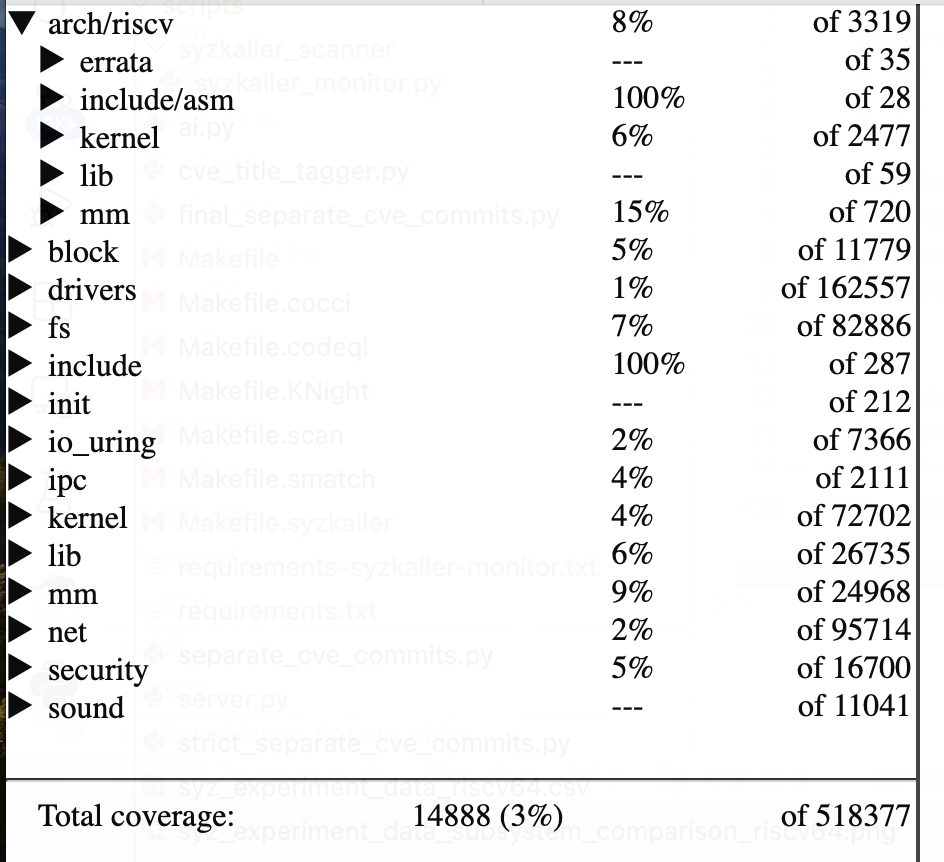
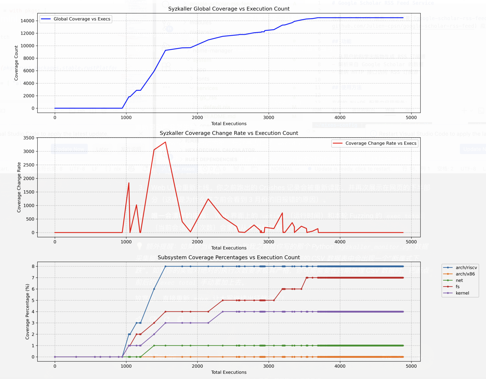
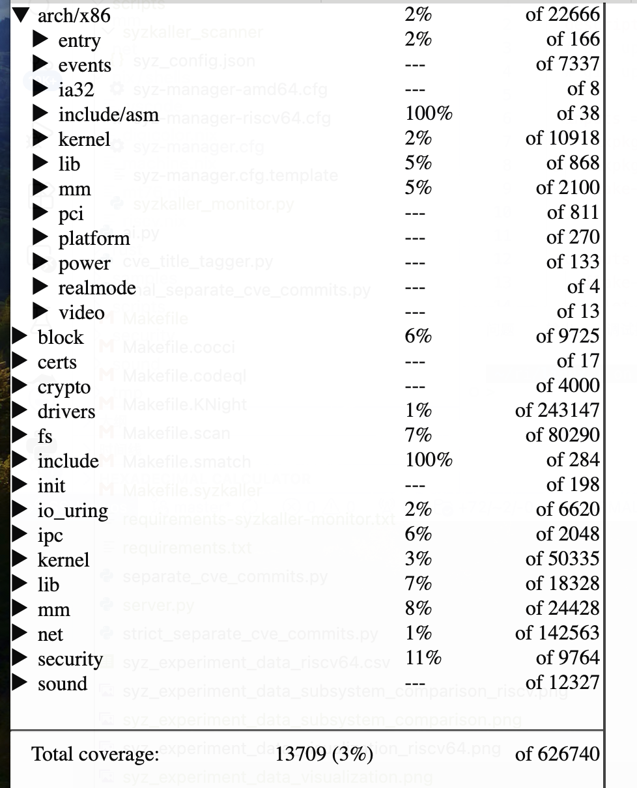
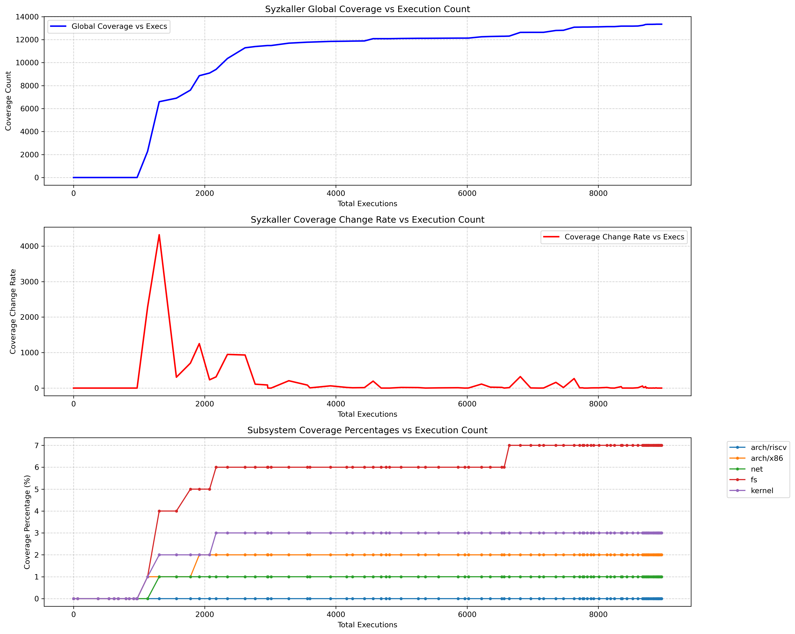

# Weekly Report 2026-04-12

## 工作任务 

## 工作进展

### Knight的召回率测试实验

Knight对于一个patch会尝试生成10个checker，每一个checker如果出现编译失败会尝试5次，所以其速度极慢，所以对于速度和准确率的权衡，使用Qwen3.5-122B-A10B的软件所chatbox中转模型进行实验

将在<https://has2lab.github.io/RISCV_CVE_Dashboard/>提取的CVE分为通用漏洞（9个）和RISC-V专有漏洞（10个），分别给Knight运行其gen阶段从而测试其召回率

| CVE编号                                                 | Best Score |
|---------------------------------------------------------|------------|
| 特殊/边缘情况遗漏（逻辑错误）\|CVE-2024-42267           | TP=0, TN=1 |
| 隐式ABI规定违反\|Unaligned Memory\|CVE-2024-43868       | TP=0, TN=0 |
| 隐式API规定违反\|CVE-2024-46792                         | TP=0, TN=1 |
| 分支路径遗漏（逻辑错误）\|Resource Leak\|CVE-2024-53075 | TP=1, TN=1 |
| 隐式API规定违反\|CVE-2024-57939                         | TP=1, TN=1 |
| 特殊/边缘情况遗漏（逻辑错误）\|CVE-2025-37975           | TP=0, TN=1 |
| 特殊/边缘情况遗漏（逻辑错误）\|CVE-2025-38433           | TP=0, TN=0 |
| 特性/机制冲突\|CVE-2025-40358                           | TP=1, TN=1 |
| 隐式时间规定违反\|CVE-2025-38681                        | 待测       |

表 1 通用漏洞

| CVE编号 | Best Score |
|----|----|
| RISC-V_MMU\|隐式API规定违反\|CVE-2024-53687 | TP=0, TN=0 |
| RISC-V_MMU\|隐式API规定违反\|CVE-2024-56673 | TP=0, TN=1 |
| RISC-V_MMU\|隐式ABI规定违反\|CVE-2024-57945 | TP=-10, TN=-10(编译错误) |
| RISC-V_Traceing(Probes/Ftrace)\|隐式ABI规定违反\|CVE-2025-22069 | TP=-10, TN=-10(编译错误) |
| RISC-V_Traceing(Probes/Ftrace)\|功能实现不完整（逻辑错误）\|CVE-2025-37822 | 配置项未开kernel编译错误 |
| RISC-V_Pointer Masking Extensions\|功能实现不完整（逻辑错误）\|CVE-2025-37966 | TP=1, TN=1 |
| RISC-V_CSR\|RISC-V_Context_Switch\|功能实现不完整（逻辑错误）\|CVE-2025-38261 | TP=-2, TN=-2(checker运行时错误) |
| RISC-V_SBI\|隐式API规定违反\|CVE-2025-38407 | TP=0, TN=1 |
| RISC-V_MMU\|特性/机制冲突\|CVE-2025-38434 | TP=-10, TN=-10(编译错误) |
| RISC-V_Vector_Extension\|功能实现不完整（逻辑错误）\|CVE-2025-38435 | TP=-10, TN=-10(编译错误) |

表 1 riscv漏洞

由于时间紧迫，未进行实验数据的深入分析，但是很明显的感觉出通用漏洞生成成功checker的频率更高

### Syzkaller的覆盖率测试实验

首先在kernel 7.0-rc5上开启ARCH=riscv defconfig以及一些必要的debug config的情况下运行syzkaller，并且使用一个python脚本轮询exec和coverage

最关键的是第三张图，其展示了riscv（蓝线）的coverage随着total exec的变化趋势，其他线分别是/net，/fs，kernel/ 可以发现，所有子系统都在8%的覆盖率以下停止了增长

然后在ARCH=x86_64 defconfig下运行syzkaller，收集exec和coverage

预期的结果是arch/x86和其他通用子系统的coverage会大于arch/riscv，但是实验的比例呈现出了相反的结果，由于时间紧迫没有进行进一步的分析

### 寻找sota工具增强上述实验(正在做，未完成)

通过下述关键词从安全四大顶会中找到了近130篇论文（2024至今），但是还在筛选中

("kernel" OR "Linux" OR "operating system" OR "OS" OR "FreeBSD") AND ("fuzzing" OR "fuzzer" OR "syzkaller" OR "vulnerability discovery" OR "bug detection" OR "static analysis" OR "symbolic execution" OR "taint analysis")

1.  论文名称：  
    - insight：  
    - sota工具：

2.  

### 使用sota工具重新做上述实验，并严谨通过实验进行推理（待做）
