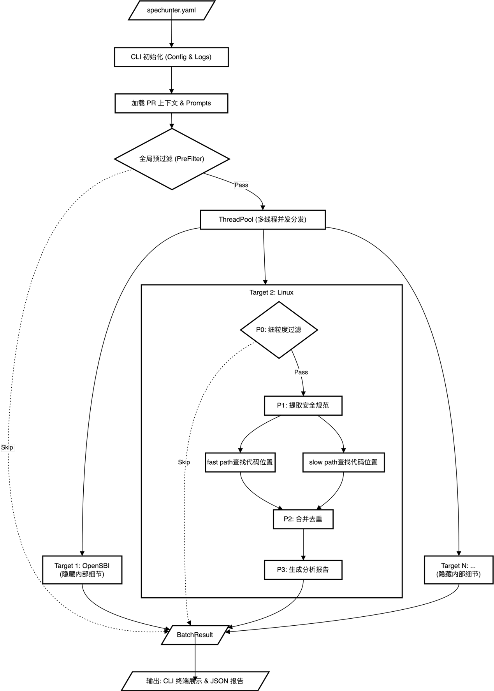
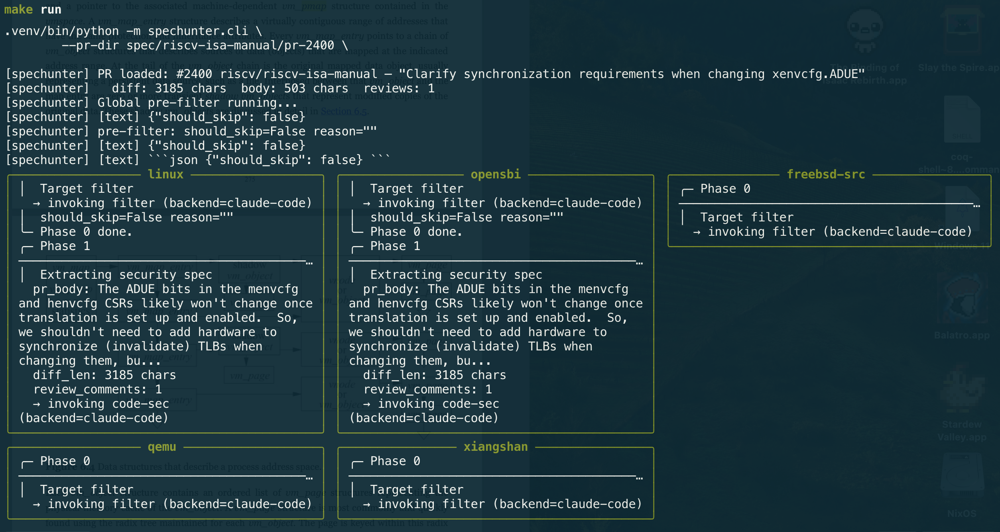

# Weekly Report 2026-05-10

## 工作任务

## 工作进展

### “通过手册增量，分析已有riscv代码”的idea

#### Idea Quik View

**1. 问题定义**

**- 依赖先验数据的瓶颈：**现有 SOTA 漏洞挖掘过度依赖历史补丁，只能“横向寻找”已知变种，难以发现因误解硬件规范（Specification）导致的全新架构级漏洞。

**- 漏洞Pattern跨平台泛化差：**传统提取的漏洞 Pattern 往往是 Software-specific（如绑定 Linux 特有机制），无法直接迁移到 FreeBSD 等其他系统。

**- LLM 上下文瓶颈：**底层架构手册极其庞杂，现有工具无法让 LLM 宏观理解整本手册来定位“语义歧义”区域。

**2. 输入输出 (Input & Output)**

**输入 (Input)：**

- RISC-V 官方开源手册

- RISC-V 官方开源手册的 Pull Requests/Commits

- 目标系统的源代码。

**输出 (Output)：**

- 目标系统中因规范同步滞后/误解导致的潜在漏洞位置。

- 以硬件文档为桥梁提取出的、跨生态系统的普适性漏洞 Pattern。

**3. 应用场景 (Application Scenarios)**

**操作系统内核安全审计：**自动化检测 Linux、FreeBSD 等内核中翻译 RISC-V 规范时的代码缺陷。

**底层固件漏洞挖掘：**应用于 OpenSBI 等强架构相关固件的安全检测。

**硬件/模拟器实现验证：**向下延伸至硬件 CPU RTL 实现的语义对齐检测。

**RISC-V 生态持续集成：**作为一个自动化的“规范守护者”，监控生态系统中软硬件对官方规范迭代的同步情况。

**解决的问题：**

**突破“横向挖掘”局限：**无需已知漏洞数据，基于官方修正的“语义盲区”直接发掘全新的 0-day 漏洞。

**打破软件生态隔离：**将分析基准从“软件特性”提升到“硬件规范”，生成的 Pattern 通用于整个 RISC-V 生态（OS/Firmware/Hardware）。

**精准绕过 LLM 窗口限制：**无需通读手册，利用 PR 作为高价值信息源，精准投喂“发生语义澄清”的局部上下文，极大提升 LLM 判别准度。

**消除规范与代码的“时间差”：**捕捉由于内核社区未能及时跟进手册 Ratified 更新而长期潜伏的历史遗留漏洞。

#### 讲故事（和上面讲的差不多，可以直接跳过）

这是一个一拍脑门想出的idea

**尝试讲好一个故事**来引出我的idea：

现有的静态分析工具大多依赖于对历史补丁（Patches）的分析来提取漏洞模式，进而在内核中横向搜索相似的变种漏洞。近年来，结合大型语言模型（LLM）的 SOTA工具极大地提升了这一过程的效率。得益于 LLM 强大的文本解析与信息检索能力，它们能够深度理解补丁背后的 RISC-V 架构强相关语义。可以预见，随着模型能力的持续演进，LLM 在理解底层架构知识及定位内核漏洞方面将展现出更强的精确性。

然而，这种范式存在一个根本性的局限：过度依赖先验数据（Prior Knowledge）。由于这类工具的分析逻辑建立在已知的代码和补丁之上，它们陷入了“横向挖掘”的瓶颈——即只能捕获已知 RISC-V 语义缺陷的同源变种，却难以突破历史数据的限制，去发现全新类型的架构级漏洞。

并且过去的范式还存在另一个新的局限，就是可能好不容易提取出的软件的pattern可能是software specific的，比如linux的某个函数与riscv的某个语义冲突，但是freebsd却没有这层语义冲突，所以这个找出的pattern只能用来检测linux。

事实上，Linux 内核中 RISC-V 架构相关代码的本质，是对底层硬件规范（Specification）的软件语义翻译。在此翻译过程中，若内核开发者对规范的语义理解存在偏差，便极易滋生底层安全漏洞。然而，受限于大规模语言模型（LLM）上下文窗口的瓶颈，现有的 SOTA 工具难以宏观关联并全面理解庞杂的手册内容，因而无法精准定位出易发生语义歧义的代码区域，导致难以利用规范进行针对性的漏洞挖掘。

突破这一局限的契机在于 RISC-V 规范的开源特性。与传统闭源架构不同，开源社区通过不断引入 Pull Request 来推动手册的迭代，这不仅包含新特性的支持，更涵盖了对原有模糊指令语义的修正与澄清（Clarification）。我们的核心洞察在于：这些被官方明确澄清的语义盲区，正是内核开发者最易发生“映射失真”的重灾区。 进一步而言，当此类澄清性更新被正式批准（Ratified）后，内核社区理应立即同步这些语义修正。如果存在同步滞后或遗漏，便意味着内核中潜伏着由于早期规范不清晰而遗留的架构级漏洞。

所以，我们创建的这个工具可以追踪riscv所有相关手册的pr，过滤出那些clarify类型的pr，通过LLM进行分析，找到内核中翻译这部分语义的部分，让LLM进行分析此处是否存在问题，由于我们有文档作为桥梁，我们总结出的pattern并不只适用于一个软件，我们可以把分析的target推广到其他操作系统，比如freebsd，甚至固件sbi，甚至推广到硬件cpu的实现，最终能推广到整个riscv生态系统。

#### 工具

**工具名称：**SpecHunter

**工具原理：**

**工具运行截图：**

**工具成果：（这是跑了一天发现的，并且还未完全人工审核完，暂时都未得到上游确认）**

<https://patchew.org/QEMU/20260508174917.371667-1-vulab@iscas.ac.cn/>

<https://github.com/OpenXiangShan/ChiselIOPMP/issues/1>

<https://lore.kernel.org/all/20260509114122.1868327-1-vulab@iscas.ac.cn/>

<http://lists.infradead.org/pipermail/opensbi/2026-April/009769.html> （这是人工发现的）

（然后发现人工确认这些漏洞才是最耗时间的）

（一些前期工作：人工跑一遍这些pipline来验证过idea的有效性，找到的几个pr结果如下：

- \#2400 — Clarify synchronization requirements when changing xenvcfg.ADUE (closed)  
  他总结出了一个pattern，即修改了xenvcfg的ADUE位之后，需要执行SFENCE.VMA，opensbi已经实现了。但是内核好像没有fence，但是内核貌似改变ADUE的场景不多，这里是否真的存在问题还需要进一步确认

- \#1581 — Specify the interaction between CSRRS/C and "reads as" bits (closed)  
  这个简而言之是对于读写不一致的寄存器，不能使用csrrs/c指令操作  
  但是不幸的是，由于这个pr提出的时间比较早，貌似linux/opensbi全部避开了用csrrs/c操作读写不一致寄存器的操作，但是这个pattern本身是很有价值的

- \#258 — Fix SBI_ERR_BAD_RANGE inequality test  
  这个是最新的sbi的某个pr，是手册中的一个off-by-one漏洞，导致opensbi实现错误，并且貌似opensbi还没有相应的issue和pr讨论这个，但是我发现邮件列表已有patch  
  （http://lists.infradead.org/pipermail/opensbi/2026-March/009608.html）  
  （所以这也是这个方法的弊端，基本上文档的修复同步到软件的速度都是很快的）

- \#2219 - Clarify constrained-unpredictable translation rule wrt VA-width change  
  这个是说在satp.MODE改变之后，需要执行sfence.vma刷新，ai找出说opensbi在sbi_domain_context_enter/exit有对satp进行切换，但是没有执行刷新，我感觉这里有bug，于是直接提了一个patch：  
  http://lists.infradead.org/pipermail/opensbi/2026-April/009769.html

）

**工具局限：**

- Ai不懂手册的上下文信息，或许需要把手册本身也作为input

- Ai找代码位置暂时还是比较慢，因为未真正实现fast path

- Ai对代码/安全规范的描述容易夸大或者不真实

- 很多规范的修改是已有软件的错误导致规范的修改，这也会导致没有办法利用这些修改

- 很多pr指出的问题比较小，即使真的存在问题，上游不一定会接受

**工具可以继续扩展的地方：**

- 把手册本身也作为input（或者pr点的上下文），是否这部分的手册应该独立于pr分析（已加）

- 实现每一个target的index，从而实现fast path

- 调整每一个target具体的prompt

- 需要引入commit等其他input

- 对未被merge的pr需要特殊处理？

- 工具需要区分bug和未实现的差别

- 在找出漏洞的时候需要指出具体引用的spec位置

**其他类似SOTA工具调研（LLM为主）：**

VulInstruct: Teaching LLMs Root-Cause Reasoning for Vulnerability Detection via Security Specifications – 这一篇是说从代码或者patch中用llm提取安全规范，让llm根据安全规范去找漏洞

RFCAUDIT: AI Agent for Auditing Protocol Implementations Against RFC Specifications – 这一篇是说如何从网络协议规范建立index，让ai能根据规范精准的找到对应的代码位置，然后对代码进行分析

#### 其他一些小思考

**一些对漏洞挖掘鄙视链的思考**

在思考我这个idea是否有意义的过程中，我发现那些通过以前的patch进行学习的工具，本质上和我的工具差不多，永远是事后诸葛亮，比如在malloc之后需要free，通过这个pattern找到了漏洞，当然，找到漏洞就算是0-day漏洞，但是如果抛弃掉原来0-day的含义，我认为这种漏洞应该归类于n-day，他有一种感觉，这种漏洞迟早被找到（所以需要卷自动化程度）

所以我的鄙视链就是

- 最强0-day – 找到了一种全新的攻击方式，比如spectre，从而找出的漏洞

- 0-day – 通过已有的攻击方式找到的漏洞

- 0-day – 通过规范到代码的映射错误，或者直接找出规范的错误，从而找到的漏洞

- 1-day – 通过规范已有的错误，找出的漏洞，即我的idea，实际上是在打一个时间差，即0-day漏洞已经被找出来了，只是他的体现方式不是在代码上，而是在自然语言文本上，我需要自动化文档到代码的映射

- N-day – 通过以前的patch找到新的类似的漏洞

所以那些能发顶会的n-day/1-day漏洞挖掘一定都是自动化程度很高的，一般都是自动挖掘pattern自动扫描，能自动发现很多漏洞（这个部分就比较卷，比如卷误报率，速度等等），越往上自动化越低，需要人脑工作的部分越多

**深入读一篇论文有感（未完）**

选定的这篇论文是：RFCAUDIT: AI Agent for Auditing Protocol Implementations Against RFC Specifications

首先必须要展现出你这方面的工作十分重要，可以从不同角度叙述

- 讲出持续跟进Spec的更改是很困难的

- 比如说某个严重的CVE就是因为没有及时跟进Spec的更改而造成的

- 讲出为什么跟进Spec是一份很需要人力的工作，并且是impossible的

- 讲出之前的工具为什么没有办法做到这件事情，及这件事情的复杂性（举出实例）
